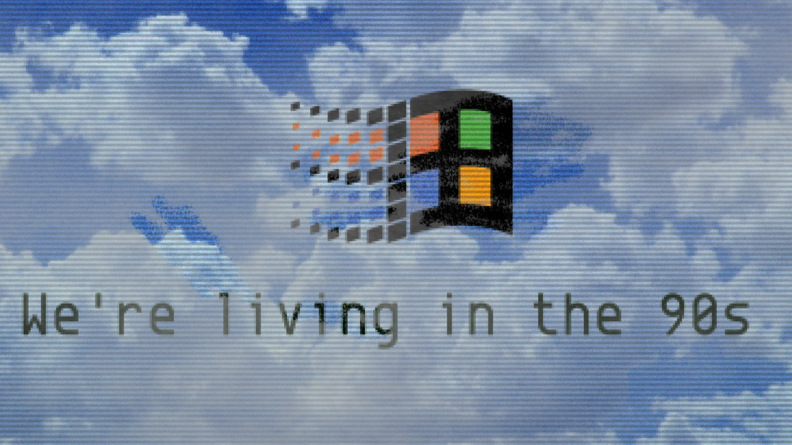
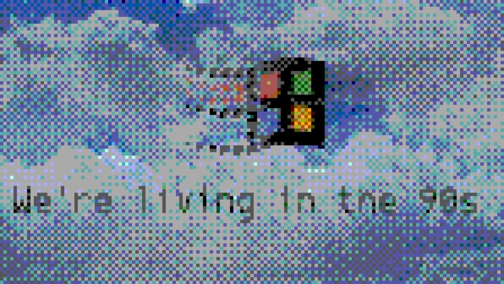
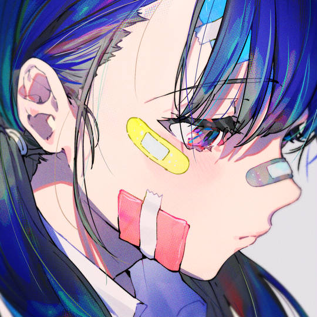
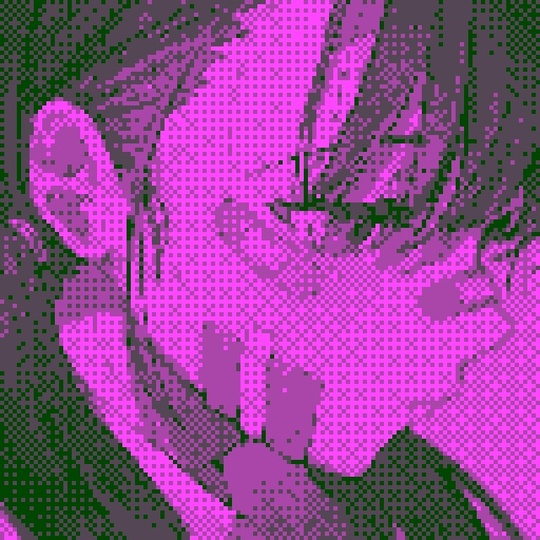
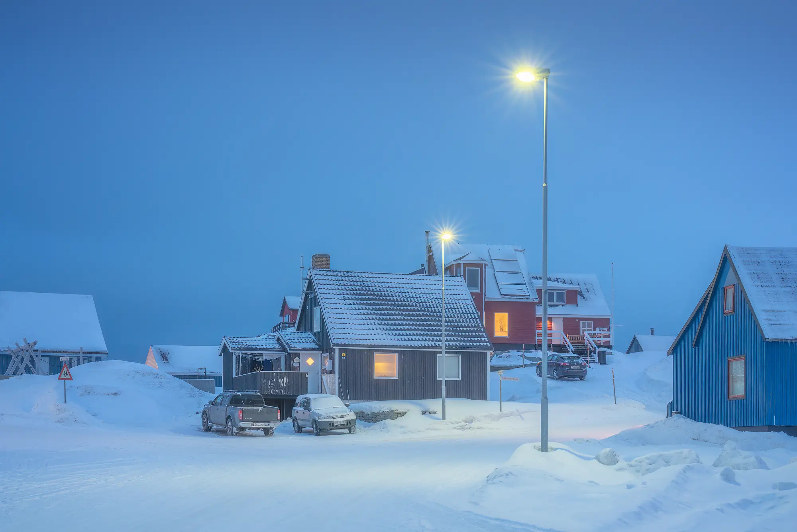
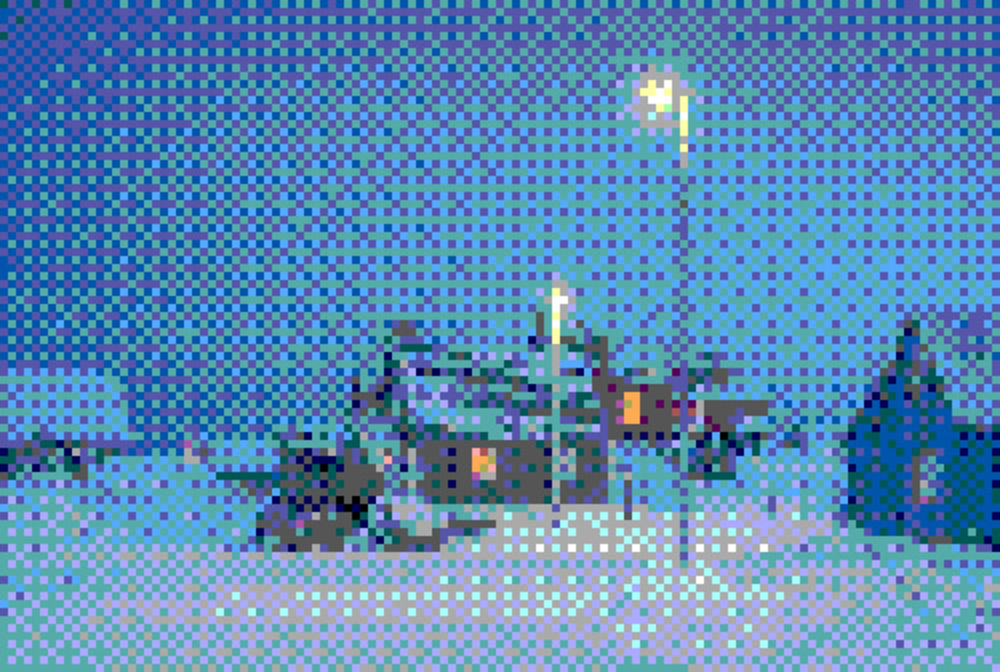

## Gameboy Camera Simulate

### Intro

Try to simulate the old-fashioned nostalgia digital picture style of Gameboy Camera, a way take you back to 1998 which reminds you of the dead days

|         Origin         |         Stylized         |
| :--------------------: | :----------------------: |
|  |  |
|  |  |
|  |  |

### Usage

Required: `opencv-python`, `numpy`

Put pictures in `run` folder than execute `main.py`.

